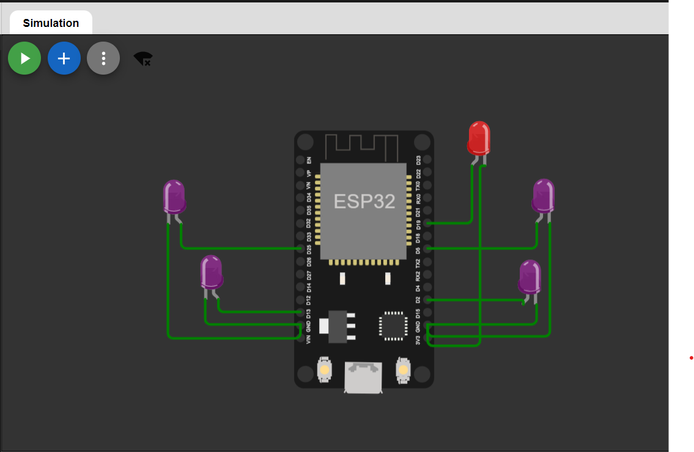
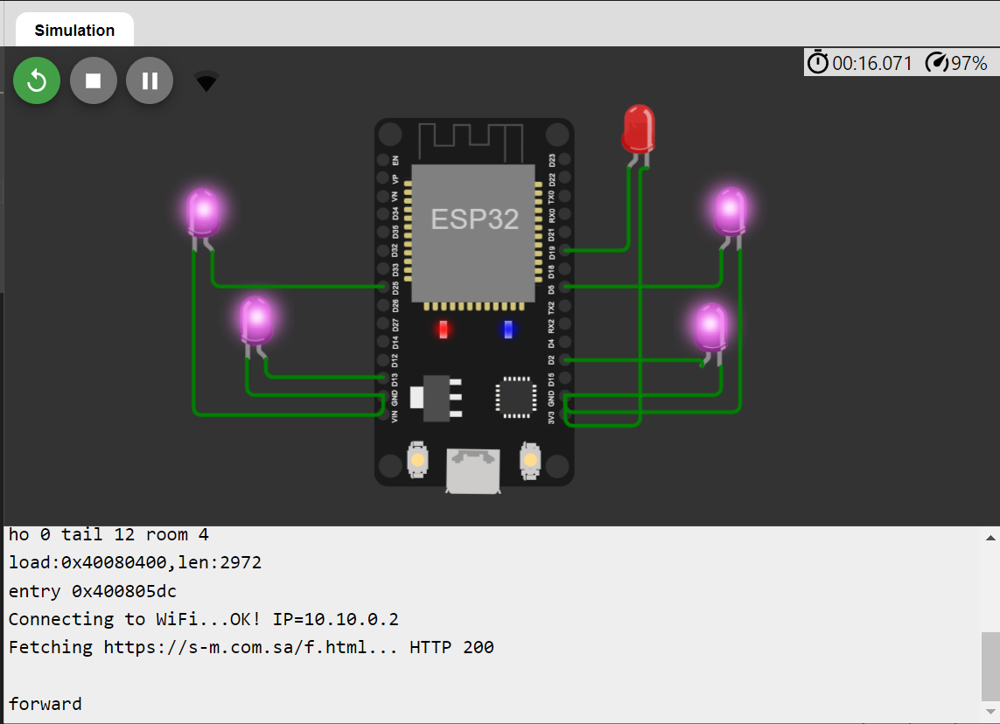
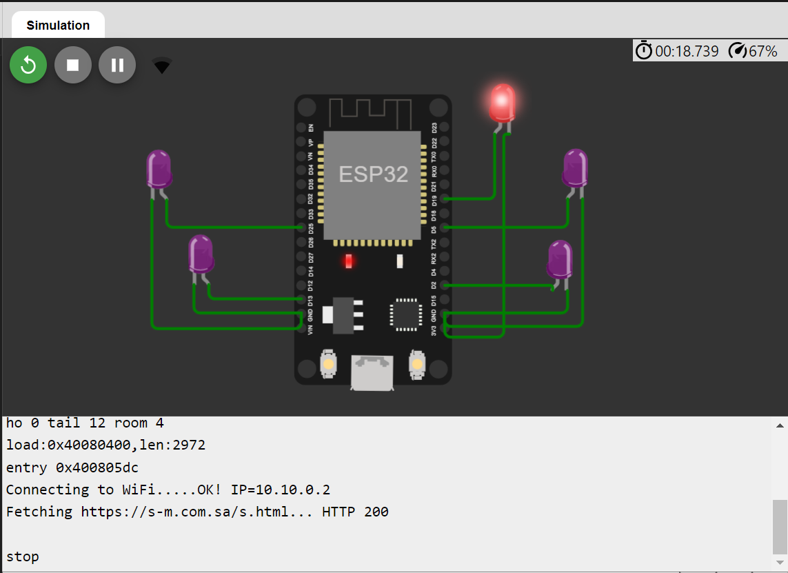
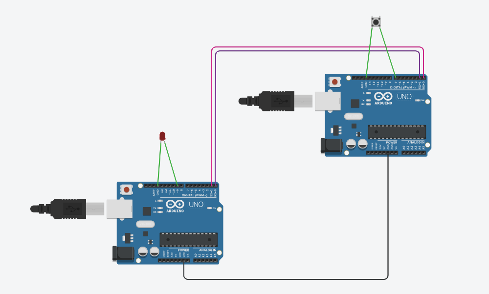
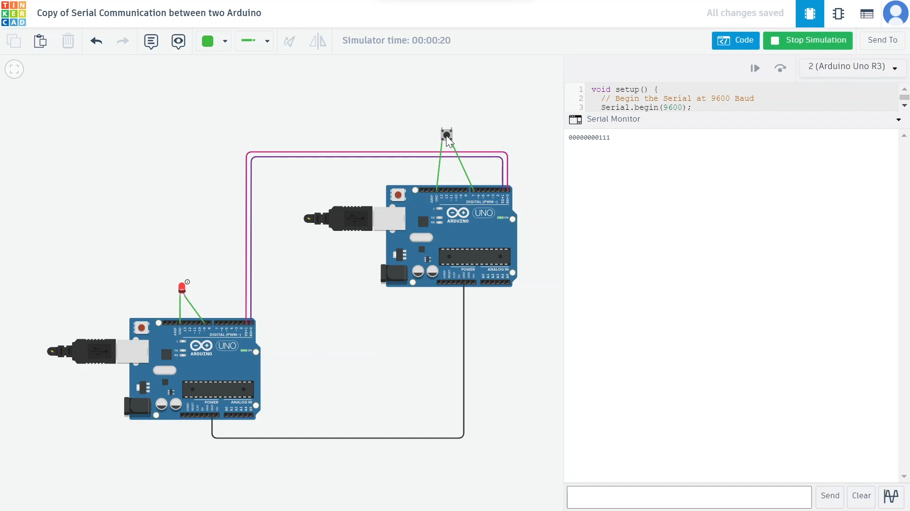

# IoT

#### Table of Content:-  
* [About](https://github.com/FatimahSul/IoT/blob/main/README.md#about-this-repository)  
* [Task1: ESP-LED Simulator](https://github.com/FatimahSul/IoT/blob/main/README.md#task-1)
* [Task2: Serial communication between 2 Arduino ](https://github.com/FatimahSul/IoT/blob/main/README.md#task-2)    
* [Used Languages](https://github.com/FatimahSul/IoT/blob/main/README.md#implemented-using-%EF%B8%8F)  
* [Resources](https://github.com/FatimahSul/IoT/blob/main/README.md#resources-)  

## About this repository 
This repository includes my work as a trainee at Smart Methods Company in the IoT Path (2023).

## Task 1
### ESP-LED Simulator

Build an ESP-led Simulator that fetches an HTML page and acts accordingly. 
My ESP-led Simulator is built with 5 LEDs, representing the four directions the robot can move in `left, right, forward, backward` and a fifth red led which represents `stop`.

### Preview 

#### Simulation outputs:
Two HTML pages are used in this simulation ( https://s-m.com.sa/f.html / https://s-m.com.sa/s.html). When fetched, the first page returns `forward`, and the later page returns `stop`. Depending on which page is contained in the const `url` one of two outputs is expected: either the 4 purple LEDs will be turned on, or the single red LED will be turned on and the rest will be turned off.  

 

* I added the red LED to make sure the ESP is working well in both cases ~ it can be deleted later.

## Task 2
### Serial communication between 2 Arduino

Build a serial communication between two Arduino one of which is connected to an LED and the other one is connected to a button. When the button is pushed the LED will turn on, else it will be turned off.  

### Circus 

#### Simulation outputs:
If the second Arduino reads `0` the LED will turn off, if it reads `1` the LED will turn on.

 

* Screen recording of the simulation is available <a href="https://github.com/FatimahSul/IoT/blob/main/Task2/simulation.mkv" > here </a>.

## Implemented using 🛠️:
* HTML, PHP
* JSON
* C
   -so far-

## Resources :
- https://www.w3schools.com
- https://wokwi.com
   -so far-

